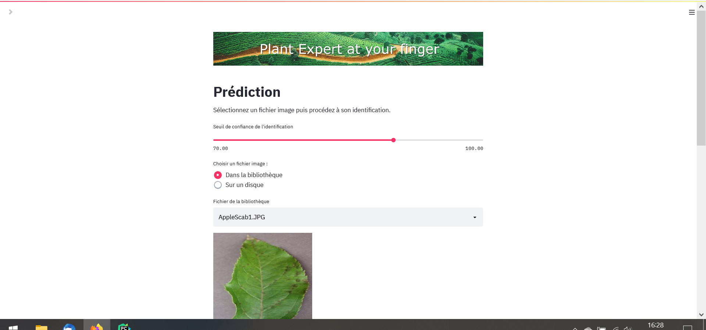
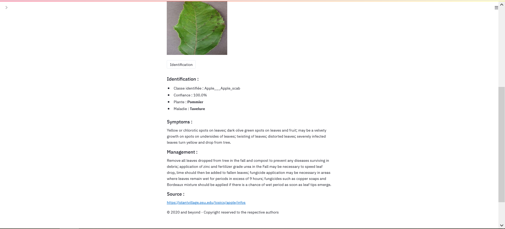

# Introduction

Ce projet est un projet pédagogique. En règle générale, par souci de discrétion et de respect pour les employeurs, les projets professionnels ne sont pas disponibles sur ce repository.

# Copie d'écrans de l'application 

## Affichage d'une prédiction faite à partir de la photo d'une plante - Page 1/2

## Affichage d'une prédiction faite à partir de la photo d'une plante - Page 2/2

## Affichage d'une segmentation et de l'identification de la composante principale de l'image faite à partir de la photo d'une plante

# projet Pystill

## Equipe
Ce projet est le fruit de la collaboration de :
  * Loïc AXILAIS  
  * Mathis RALAIVAO  
  * Noël MAURICE  

Avec le support bienveillant de Thomas BOEHLER (chef de projet DataScientest)

## Introduction
Dans le cadre de la formation **Data Scientist - Bootcamp Octobre 2020**, l'équipe a retenu ce projet pour valider son cursus. L’objectif du projet est de localiser et classifier l’espèce d’une plante dans une image.     
Une fois la classification faite, il retourne à l’utilisateur une description de la plante et identifie les possibles maladies. L’application est donc capable à partir d’une photographie de donner une succession d’informations à l’utilisateur.

## Contenu du référentiel
Ce référentiel GitHub contient les dossiers suivants :
  * __doc__ : documentations du projet
  * __sources__ : code sources des différentes étapes du projet
    * __dataviz__ : notebooks relatifs à l'analyse des données et à la réduction des dimensions
    * __exploration_1__ : notebooks relatifs à l'élaboration du premier modèle CNN de classification (itération 1)
    * __exploration_2__ : notebooks relatifs à l'élaboration du second modèle CNN de classification (itération 2)
    * __lib__ : fonctions utilitaires nécessaires aux différents modules du projet
    * __segmentation__ : notebooks relatifs à l'élaboration du modèle de segmentation des images
    * __streamlit__ : consolidation des différents travaux à travers une application développée avec Streamlit

## Principe
L'application Streamlit présente les différentes étapes de la construction des modèles (classification, segmentation) et propose une interface permettant à l'utilisateur de réaliser des prédictions sur des photographies contenant la **feuille d'une plante**.
Le modèle de classification est capable :
  1. d'identifier si la photo contient une feuille de plante ou non
  2. de déterminer l'espèce de la plante
  3. de déterminer si la plante est saine et dans le cas contraire d'identifier une maladie

L'entraînement du modèle de classification s'est limité :
  * Aux espèces suivantes : *Cerise et griotte, Courge, Fraise, Framboise, Maïs, Myrtille, Orange, Pêche, Poivron, Pomme, Pomme de terre, Raisin, Soja, Tomate*.
  * Aux maladies suivantes : *Alternariose, Bactériose, Brûlure, Cercosporiose, Cladosporiose, Corynesporiose, Helminthosporiose du nord, Isariopsis, Maladie du bois, Mildiou, Oïdium, Pourriture noire, Rouille commune, Rouille de virginie, Septoriose, Tavelure, Tétranyque, Verdissement, Virus des feuilles jaunes en cuillère, Virus Mosaïque*.

## Source de données
Les modèles ont été entraînés sur les données disponibles dans le dataset **new-plant-diseases-dataset**.  
Pour des raisons de volumétrie (3Go), les données ne sont pas présentes dans ce référentiel GitHub mais sont téléchargeables depuis https://www.kaggle.com/vipoooool/new-plant-diseases-dataset.

## Application Streamlit
Pour lancer l'application, exécuter l'instruction suivante `streamlit run pesMain.py`
